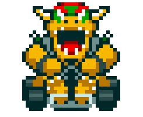

<h1 align="center">Mario Kart.JS</h1>

<p align="center">
  
</p>

<p align="center">
  <b>Desafio de projeto da DIO (Digital Innovation One)</b><br/>
  Simulador de corrida em Node.js inspirado em Mario Kart, rodando direto no terminal.
</p>

## Objetivo

Simular uma corrida entre 2 personagens em 5 rodadas, aplicando regras de pista, confronto e pontuacao com base nos atributos de cada corredor.

## Personagens

<table>
  <tr>
    <td align="center">
      <p><b>Mario</b></p>
      
      <p>Vel: 4 | Man: 3 | Pod: 3</p>
    </td>
    <td align="center">
      <p><b>Peach</b></p>
      
      <p>Vel: 3 | Man: 4 | Pod: 2</p>
    </td>
    <td align="center">
      <p><b>Yoshi</b></p>
      
      <p>Vel: 2 | Man: 4 | Pod: 3</p>
    </td>
  </tr>
  <tr>
    <td align="center">
      <p><b>Bowser</b></p>
      
      <p>Vel: 5 | Man: 2 | Pod: 5</p>
    </td>
    <td align="center">
      <p><b>Luigi</b></p>
      
      <p>Vel: 3 | Man: 4 | Pod: 4</p>
    </td>
    <td align="center">
      <p><b>Donkey Kong</b></p>
      
      <p>Vel: 2 | Man: 2 | Pod: 5</p>
    </td>
  </tr>
</table>

## Regras do jogo

- A corrida tem 5 rodadas.
- A cada rodada, e sorteado um bloco: `RETA`, `CURVA` ou `CONFRONTO`.
- Em `RETA`: dado (1-6) + `VELOCIDADE`.
- Em `CURVA`: dado (1-6) + `MANOBRABILIDADE`.
- Em `CONFRONTO`: dado (1-6) + `PODER`.
- Em `RETA` e `CURVA`, o maior total ganha 1 ponto.
- Em `CONFRONTO`, o perdedor perde 1 ponto (nunca abaixo de 0).
- No fim das 5 rodadas, vence quem tiver mais pontos.

## Interface no console

- Menu visual para selecao de 2 personagens.
- Validacao de entrada invalida.
- Impede selecao duplicada do mesmo personagem.
- Exibe placar por rodada e resultado final.

## Requisitos

- Node.js 18+

## Como executar

```bash
npm install
npm start
```

## Estrutura do projeto

```text
Mario-kart/
  docs/
  src/
    index.js
  package.json
  readme.md
```

## Proximas melhorias

- Modo torneio (melhor de 3 corridas).
- Ranking local de vitorias.
- Testes automatizados das regras.

## Licenca

MIT
